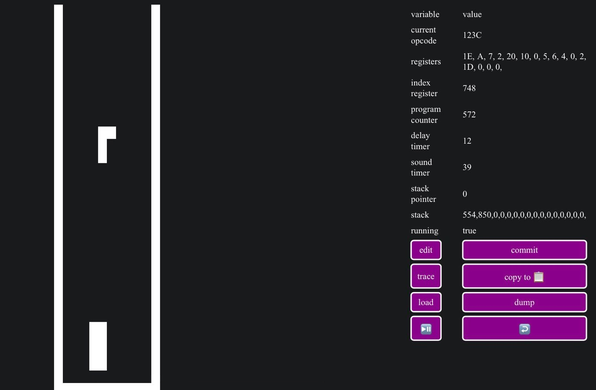

# chiphuit

Yet another chip8 emulator, written in Rust compiled to WASM.

# play

The emulator is hosted online [here](https://chiphuit.glitch.me/) if you want to give it a try without building from sources, you will have to give the emulator the game you want to play, here's some [chip8 games](https://github.com/kripod/chip8-roms/tree/master/games) to download. Works on touchscreen devices as well.

|  |
|:--:|
| *The emulator playing Tetris with the debugger view next to it* |

The emulator also has a debugger view that allows to

* See the emulator internal variables
* Load a JSON VM snapshot to the emulator in order to replay from a specific snapshot
* Copy the current VM snapshot in your clipboard in JSON format
* Trace the VM snapshot at each CPU cycle
* Dump all the traced VM snapshots to your clipboard in JSON format
* Pause / play the emulator & return to gamepad view

An example of VM snapshot is avalaible in `assets/tetris_snapshot.json`.

# build & run from sources

## lazy docker way:

```
docker build -t chiphuit -f Dockerfile .
```

```
docker run -p 4000:4000 chiphuit:latest
```

And visit http://127.0.0.1:4000 with your favorite web browser.

## not the lazy docker way:

Make sure you have rust toolchain installed and up to date.

If not, install Rust toolchain:

```bash
curl --proto '=https' --tlsv1.2 -sSf https://sh.rustup.rs | sh
```

Download the _[wasm-bindgen-cli](https://crates.io/crates/wasm-bindgen-cli)_ and _[basic-http-server](https://crates.io/crates/basic-http-server)_ crates.

```bash
cargo install basic-http-server wasm-bindgen-cli
```

_wasm-bindgen_ and _cargo_ versions must match, make sure _cargo_ is up to date:

```bash
cargo update
```

Add wasm to rustup targets:

```bash
rustup target add wasm32-unknown-unknown
```

Then run,

```
cargo build --release
```

Then run `wasm-bindgen` to generate JS bindings for the wasm file:

```
wasm-bindgen ./target/wasm32-unknown-unknown/release/chiphuit.wasm \
--out-dir build \
--no-typescript \
--target no-modules \
--remove-name-section \
--remove-producers-section \
--omit-default-module-path \
--omit-imports
```

Finally, serve the emulator and play it on your favorite browser @ http://127.0.0.1:4000

```
basic-http-server build/
```

# Demo

Here's a video of the emulator running on an iPhone.

[](https://www.youtube.com/watch?v=Ix_EGr-9nWQ)

# Documentation

Generate & read the documentation of the project

```bash
cargo doc --document-private-items --open
```

Useful links that helped me understand the basics of writing an emulator:

[How to write a chip8 emulator by Laurence Muller](https://multigesture.net/articles/how-to-write-an-emulator-chip-8-interpreter/)

[Wikipedia page describing chip8 architecture, opcodes, display etc](https://en.wikipedia.org/wiki/CHIP-8)

[Awesome chip8 rom to test opcodes correctness](https://github.com/corax89/chip8-test-rom)
