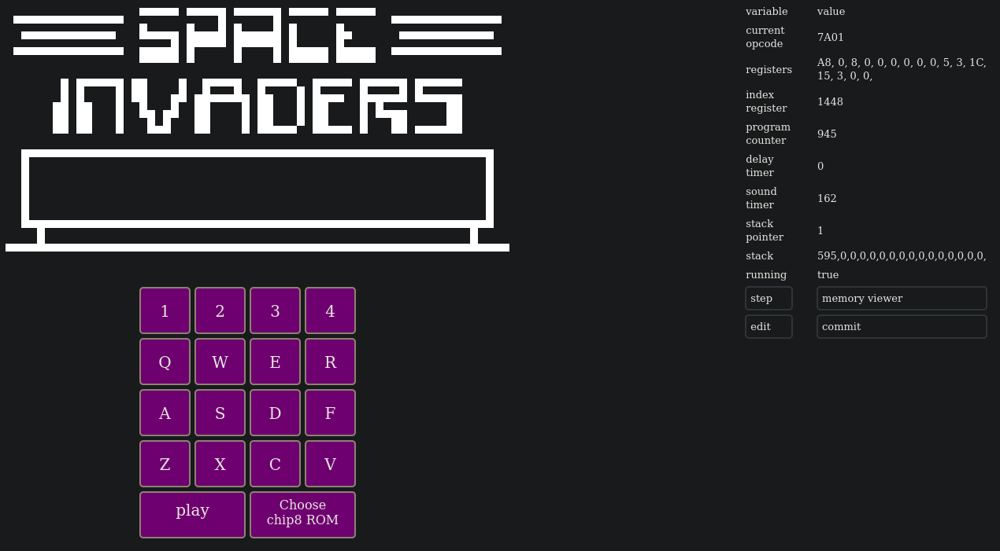

# chiphuit

Yet another chip8 emulator, written in Rust compiled to WASM.



# play

The emulator is hosted online [here](https://chiphuit.glitch.me/) if you want to give it a try without building from sources, you will have to give the emulator the game you want to play, [some chip8 games to download](https://github.com/kripod/chip8-roms/tree/master/games).

# build from sources

Make sure you have rust toolchain installed and up to date.

If not, install Rust toolchain:

```bash
curl --proto '=https' --tlsv1.2 -sSf https://sh.rustup.rs | sh
```

Download the _[wasm-bindgen-cli](https://crates.io/crates/wasm-bindgen-cli)_ and _[basic-http-server](https://crates.io/crates/basic-http-server)_ crates.

```bash
cargo install basic-http-server wasm-bindgen-cli
```

_wasm-bindgen_ and _cargo_ versions must match, make sure _cargo_ is up to date:

```bash
cargo update
```

Add wasm to rustup targets:

```bash
rustup target add wasm32-unknown-unknown
```

Then run,

```bash
cargo build
```

Then run `wasm-bindgen` to generate JS bindings for the wasm file:

```
wasm-bindgen ./target/wasm32-unknown-unknown/release/chiphuit.wasm --out-dir build --no-typescript --target no-modules --remove-name-section  --remove-producers-section --omit-default-module-path --omit-imports
```

Finally, serve the emulator and play it on your favorite browser @ http://127.0.0.1:4000

```
basic-http-server build/
```

# Documentation

Generate & read the documentation of the project

```bash
cargo doc --document-private-items --open
```

Useful links that helped me understand the basics of writing an emulator:

[How to write a chip8 emulator by Laurence Muller](https://multigesture.net/articles/how-to-write-an-emulator-chip-8-interpreter/)

[Wikipedia page describing chip8 architecture, opcodes, display etc](https://en.wikipedia.org/wiki/CHIP-8)

[Awesome chip8 rom to test opcodes correctness](https://github.com/corax89/chip8-test-rom)

## Todolist

### soon

- use a Bus structure to handle I/Os instead of bloated RefCells & closures everywhere
- add beep sound with [web_sys::AudioContext](https://rustwasm.github.io/wasm-bindgen/api/web_sys/struct.AudioContext.html)
- Allow to hide emulator state on click while running, otherwise allow modifying emulator variables
- Allow other compilation targets than WASM and find a crate to render the screen (egui | wgpu | winit | glfw), or just run the emulator in the terminal?
- how about remapping keys to 1234/qwer/asdf/zxcv like everybody
- refactooooooor

### osef / pinaillage

- Avoid ROM in string format in loading and directly use [read_as_array_buffer](https://rustwasm.github.io/wasm-bindgen/api/web_sys/struct.FileReader.html#method.read_as_array_buffer) instead of [read_as_binary_string](https://rustwasm.github.io/wasm-bindgen/api/web_sys/struct.FileReader.html#method.read_as_binary_string)
- allow tracing opcodes
- responsive CSS
- add error handling to code instead of all the wild unwraps
- set FPS / emulator speed during runtime
- add gamepad support with [browser API](https://rustwasm.github.io/wasm-bindgen/api/web_sys/struct.GamepadEvent.html) not sure this one makes sense for chip8, but it will definitely be useful for future gaming architectures
