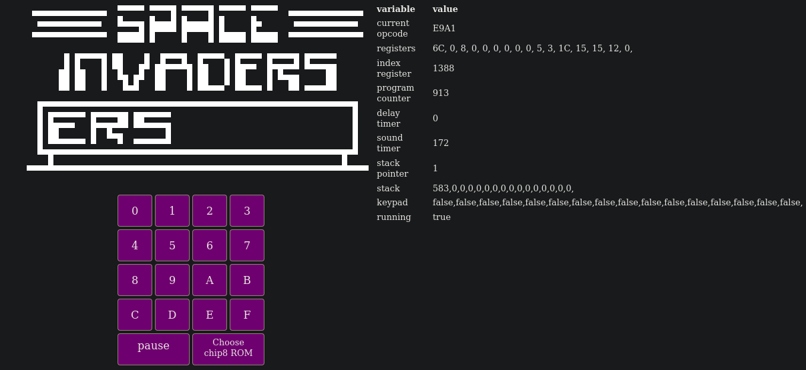

late night coding trying to code my first emulator (chip8) with rust and webassembly

Currently, ROMs are hardcoded in the WASM binary and correctly loaded, CHIP8 opcodes are correctly parsed and handled. Yet the keypad / keyboard events aren't handled on the WASM part.

useful docs:

https://multigesture.net/articles/how-to-write-an-emulator-chip-8-interpreter/
https://en.wikipedia.org/wiki/CHIP-8

TODO:

- Get rid of hardcoded ROM and allow user to select one
- Handle inputs
- Allow setting breakpoint and modifying emulator variables
- factorize emulator state rendering
- add beep sound with web_sys::{AudioContext, OscillatorType};
- add gamepad support with APIs https://rustwasm.github.io/wasm-bindgen/api/web_sys/struct.GamepadEvent.html & https://developer.mozilla.org/en-US/docs/Web/API/GamepadEvent
